Here's a comprehensive breakdown of how the X (Twitter) algorithm works in 2026:

**The big January 2026 change**

In January 2026, xAI released a Grok-powered version of the algorithm, replacing the legacy system with a transformer model that reads every post and watches every video to match users with content. The platform now processes 500 million daily tweets and makes 5 billion ranking decisions per day.

Let me visualize the core pipeline first:**The three-stage pipeline**
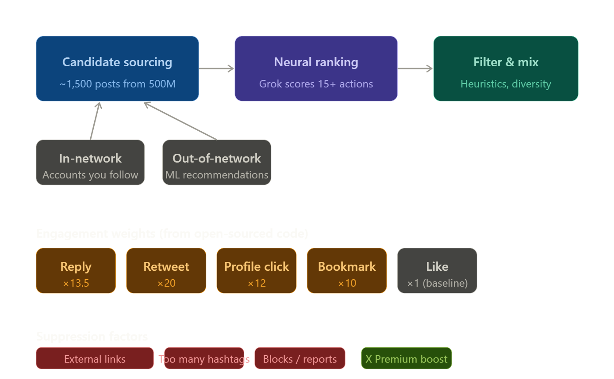
X uses a three-stage pipeline: candidate sourcing (pulling ~1,500 candidates from 500M tweets) → neural network ranking → heuristics and filtering. The ranking model predicts probabilities across 15+ different user actions — not just a single relevance score.

**Engagement weights**

X is unique in that we know the exact weights from the open-sourced algorithm code: Likes × 1, Retweets × 20, Replies × 13.5, Profile Clicks × 12, Link Clicks × 11, Bookmarks × 10. The key insight is that conversation depth dominates — one genuine reply chain where the author engages back is worth more than hundreds of likes.

**The three feeds**

X's algorithm is split across three tabs: the "For You" tab shows tweets the algorithm believes you'll find interesting (including from accounts you don't follow), the "Following" tab displays tweets from followed accounts in mostly chronological order, and the "Explore" tab highlights trending content across the platform.

**Key ranking signals**

- **Engagement velocity** — how quickly your tweet gets engagement after posting is the strongest signal. The algorithm watches the first 30–60 minutes closely.
- **Time decay** — a tweet loses half its visibility score every six hours. After 24 hours, algorithmic distribution is minimal.
- **TweepCred score** — every account carries a TweepCred score from 0–100, calculated using a weighted PageRank approach. Factors include account age, follower-to-following ratio, and engagement quality. Accounts below a 0.65 threshold have only 3 of their tweets considered for distribution.
- **Content format** — external links suffer severe algorithmic suppression, especially for non-Premium accounts. Native video gets the strongest boost as X competes with TikTok and YouTube Shorts.
- **X Premium** — Premium subscribers receive a significant distribution boost — their tweets can reach an audience that would require 4–8x the organic engagement for non-verified accounts to match.

**What doesn't matter much**

Hashtags are effectively irrelevant for algorithmic distribution — the Grok-powered model reads tweet content directly and understands topics without them. Excessive use is actually penalized.

In short: the algorithm rewards fast conversation, deep replies, native content, and platform loyalty (no external links). A single genuine reply thread where you reply back to someone is worth far more than dozens of likes.

### Give me a detailed action plan for Phase 1 of growing on X from 0 to 500 followers
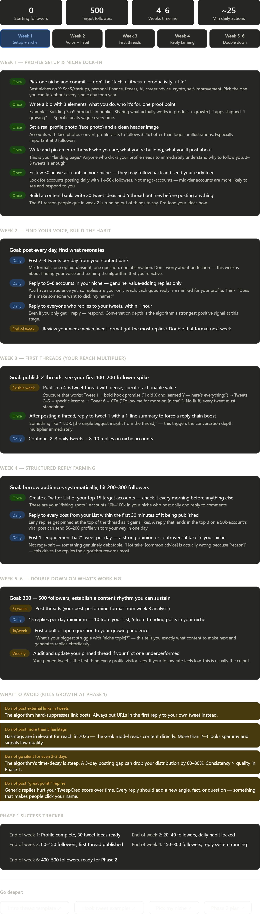

The most important thing to internalize about Phase 1: at zero followers, you have no distribution. The algorithm has no data on you, so it gives your posts almost no reach by default. That's why replies are more important than original content at this stage — every reply you fire on a bigger account is your content appearing in front of an audience that already exists.

The profile setup week is not optional or something to rush. A half-finished bio and no pinned thread means every profile visitor you earn through replies just bounces. You're filling a leaky bucket. Get the foundation airtight first, then go loud.

The 500 follower milestone matters more than the number suggests — it's the threshold where the algorithm starts treating your account as "established" rather than new, your TweepCred score starts to solidify, and you have enough social proof that new profile visitors convert at a meaningfully higher rate. Everything after 500 gets easier. This phase is the hardest grind.

### i want to grow my page to 10k and my tweet to 1000k views per day?

Solid goal. Here's a full playbook broken into phases — what to focus on at each stage of growth, with the tactics that actually move the needle given how the 2026 algorithm works.
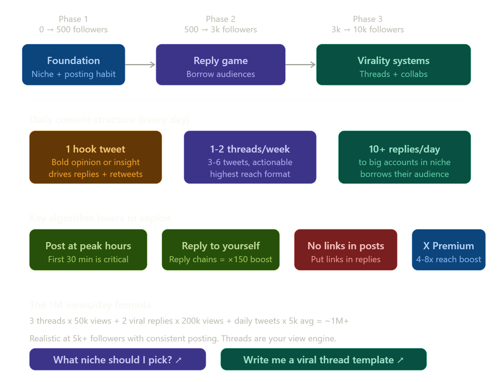

Here's how to think about each phase:

**Phase 1 — Foundation (0 → 500)**
Pick one niche and own it hard. Your profile should make it instantly clear what you talk about. Post 2-3 times daily, optimize your bio, and spend more time replying to bigger accounts in your niche than posting yourself. This is how you bootstrap your audience when no one knows you yet.

**Phase 2 — Reply game (500 → 3k)**
This is the "borrow audiences" phase. Find the top 20 accounts in your niche and reply to every single post they make — with genuinely insightful, witty, or contrarian takes. When 100k-follower accounts reply back or like your comment, their audience sees you. Threads become your main reach driver at this stage: 3-6 tweets, packed with actionable value, posted 3x/week.

**Phase 3 — Virality systems (3k → 10k)**
Start collaborating with accounts at your size or slightly above (quote tweets, spaces, co-threads). One viral thread can spike you by 500-1000 followers in a day. The algorithm at this point starts compounding — strong TweepCred score means your posts get wider initial distribution, so the reply chain momentum matters even more.

**The 1M views/day reality check**

At 5k+ followers, this is achievable but requires consistency. The math: 2-3 threads per week averaging 50-100k views each, daily hook tweets getting 5-10k views, and a few replies on big accounts going semi-viral. Threads are your view engine — a single well-crafted thread hitting a resonant topic can do 200-500k views alone.

One tactic that's underrated: reply to your own tweets within 30 minutes with an expansion, a hot take, or a follow-up question. The algorithm sees a "conversation starting" and boosts distribution dramatically — the reply chain multiplier is the biggest lever most people miss.

Also — what's your niche? That changes the strategy significantly (tech/startup content behaves differently from personal finance or fitness). Happy to build a more specific plan once I know what you're building around.

### Give me a detailed action plan for Phase 2 of growing on X from 500 to 3k followers
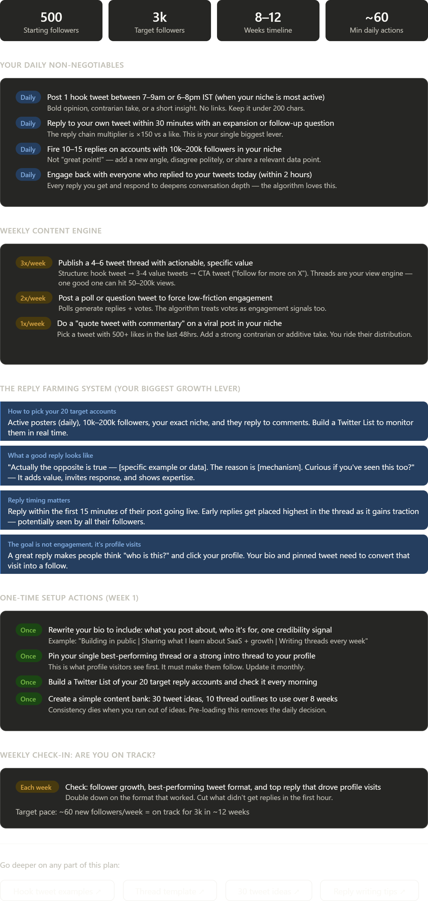

Let me build you a complete Phase 2 battle plan.The single most important mindset shift for Phase 2: you are not broadcasting, you are infiltrating existing audiences. Your own tweets matter less than where you show up in other people's threads. One clever reply on a 100k-account's post that gets 50 likes is worth more than 20 original tweets nobody sees.

The compounding effect kicks in around week 4-6 — your TweepCred score rises, the algorithm starts giving your posts wider initial distribution, and new followers start coming from the algorithm itself rather than just your reply farming. That's when you shift to 60% content creation and 40% replies, instead of the reverse.

The hardest part isn't strategy — it's showing up daily when growth feels slow in weeks 1-3. Stick to 60+ daily actions minimum and the numbers will follow.

### Give me a detailed action plan for Phase 3 of growing on X from 3k to 10k followers
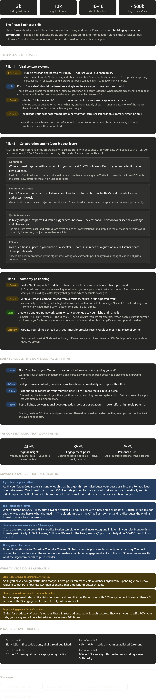

The thing that surprises most people about Phase 3 is how different the game feels. In Phase 1 and 2, growth is almost entirely manual — you grind replies, you post consistently, you slowly build an audience tweet by tweet. In Phase 3, the algorithm starts doing meaningful work for you. Your TweepCred score is strong, your engagement history is established, and a single breakout thread can add more followers in 48 hours than two weeks of grinding did in Phase 1.

The collaboration piece is genuinely the biggest unlock most creators miss. A co-thread with a 15k account — where you both promote it simultaneously — creates a combined first-30-minute engagement spike that the algorithm reads as "this content is hot" and pushes to cold For You feeds neither of you would reach alone. It's not just 2x reach, it's more like 5–6x because of how the algorithm amplifies the combined signal.

The hardest mental shift is moving from "how do I get noticed" to "how do I become a reference point." When people in your niche start quoting your frameworks, referencing your threads, or tagging you to settle a debate — that's when the 10k milestone becomes a matter of time rather than effort. That's the real Phase 3 goal.

### What should I post on X to hit 1 million views per day?

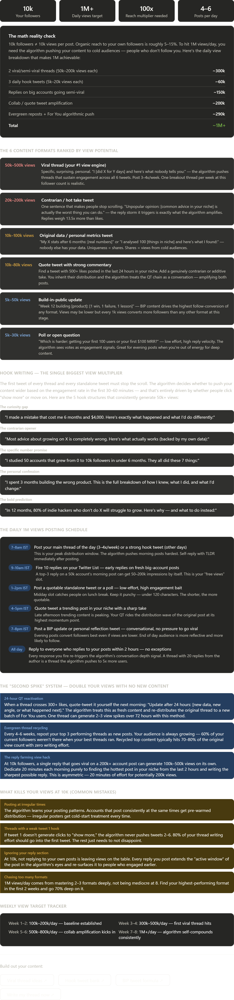

The key insight most 10k accounts miss: 1M views/day is not about posting 10x more — it's about the algorithm multiplying each post far beyond your follower count. At 10k with a healthy TweepCred score, a single well-hooked thread that catches early engagement gets pushed to cold For You feeds automatically. Your followers are the seed, the algorithm is the engine.

The math works out to roughly 3 sources of views working simultaneously: your own content driving 30–40% of total views, reply farming on bigger accounts driving another 15–20%, and collabs + algorithmic For You distribution making up the rest. If any one of those three legs collapses — you stop replying, you skip a collab week, or your hooks get lazy — the total drops fast.

The one thing I'd bet on most heavily: obsess over your thread hooks. Spend 30% of your writing time on tweet 1 alone. Everything else is secondary — because a great hook with mediocre body content will still outperform a mediocre hook with a brilliant body. The algorithm never sees your body tweets if tweet 1 doesn't pass the scroll test.

Given that you're building Aariv and working across multiple SaaS projects, your natural edge is the build-in-public angle — real metrics, real failures, real product decisions. That's your moat. Generic "productivity tips" creators are everywhere, but nobody else is building exactly what you're building. Lean into that hard.

### Give me 5 example hook tweets I can use to grab attention on X

Here are 5 high-converting hook tweets tailored to your builder/SaaS background — each using a different proven structure:
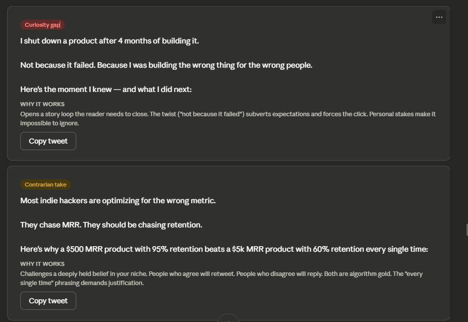
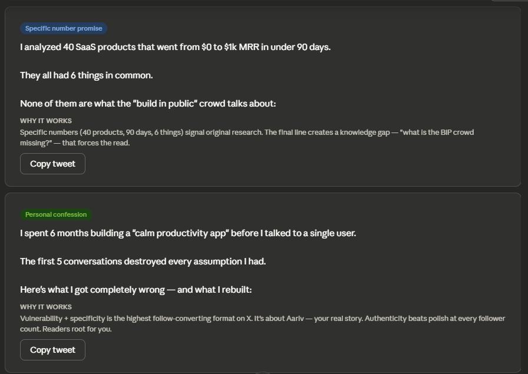
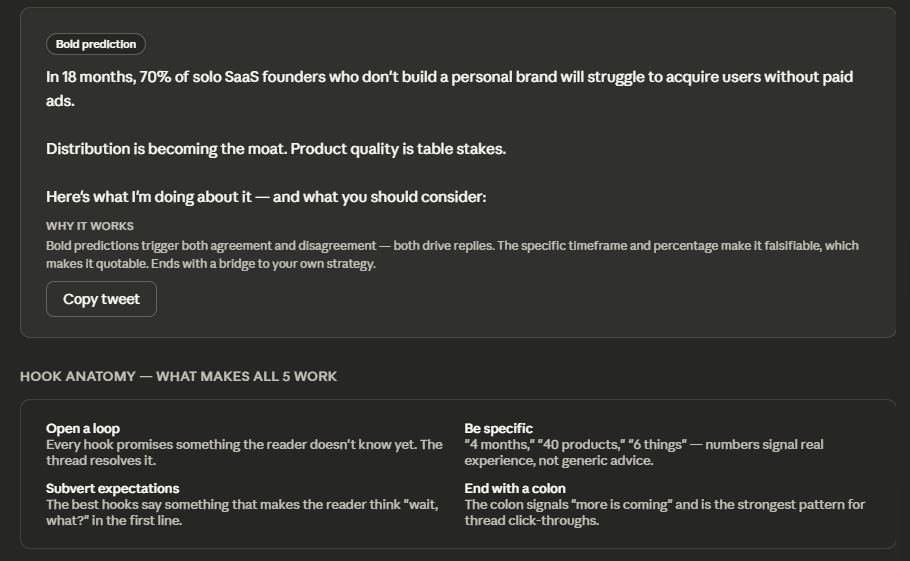
Here are 5 high-converting hook tweets tailored to your builder/SaaS background — each using a different proven structure:Notice that hooks 4 and 5 are written specifically around Aariv and your builder journey — those will outperform any generic template because they're true. The algorithm can't tell the difference, but your readers can, and authentic specificity is what makes people click through and then follow.

Hook 4 (the personal confession about Aariv) is your strongest one to post first. It opens a real story loop, it's emotionally honest, and the "destroyed every assumption" line is the kind of thing people screenshot. Post that as a thread this week and see how it lands — it'll tell you a lot about where your audience resonates most.

### Give me 5 example thread ideas I can post on X to get 1000k views

Here are 5 thread ideas engineered for 100k+ views, each built around your real story as a builder:
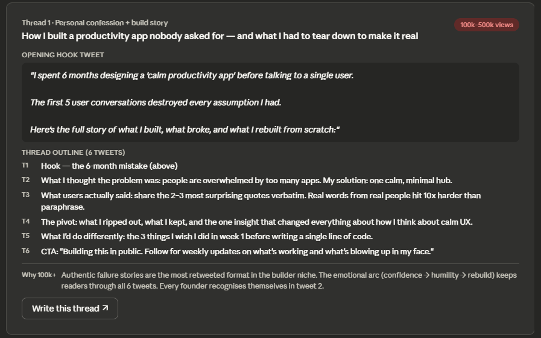

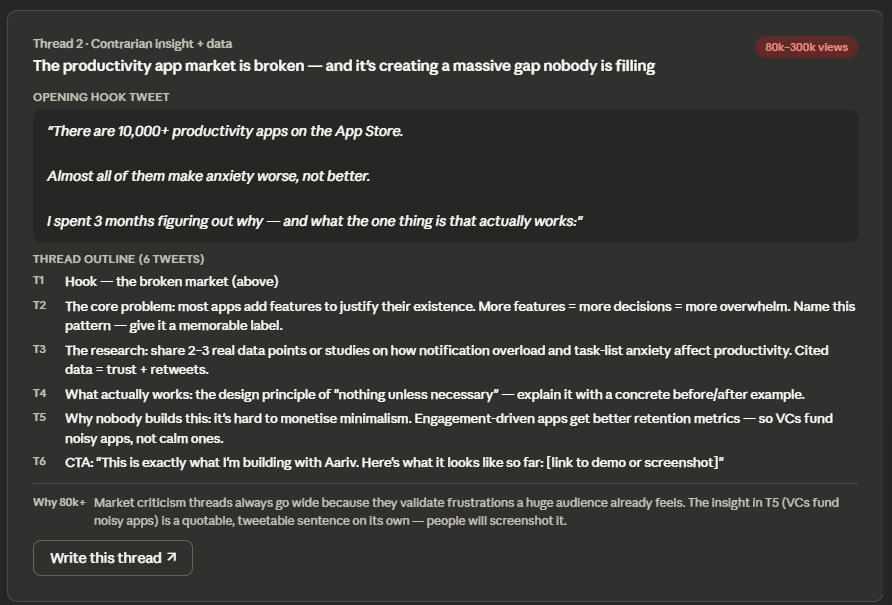
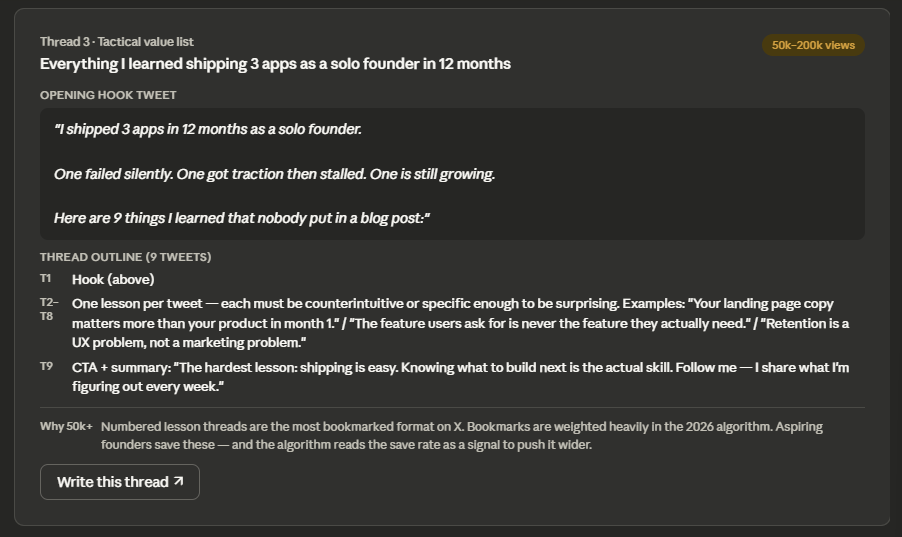

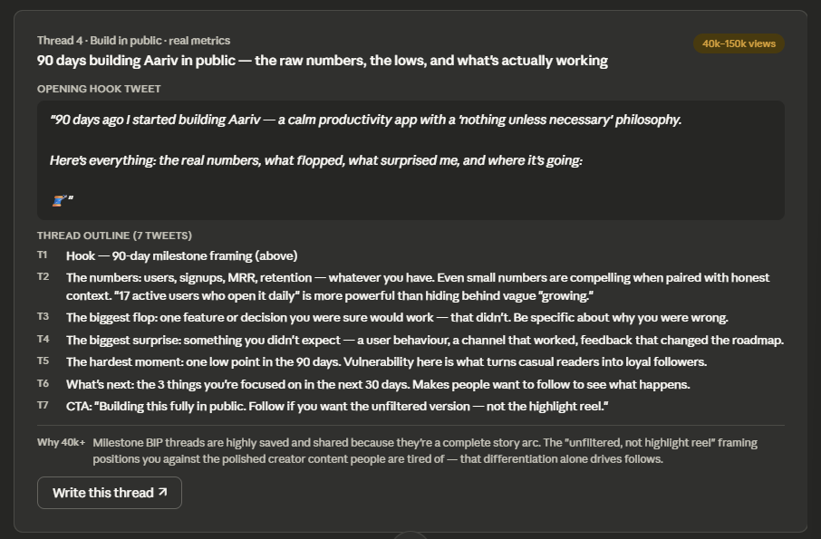

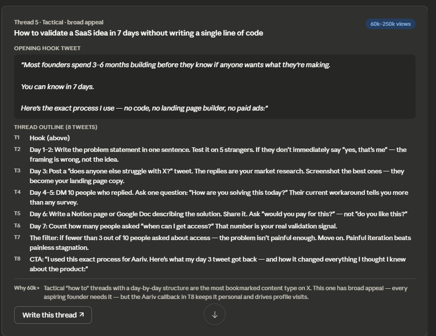

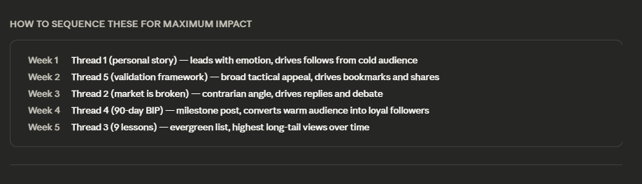

Here are 5 thread ideas engineered for 100k+ views, each built around your real story as a builder:

Thread 1 is the one to start with. It's built entirely from your real Aariv story — the 6 months of building before user conversations, the assumptions that broke down, the rebuild. That authenticity is something no one can copy, and the builder community on X will recognize themselves in every tweet. That recognition is what drives shares.

Thread 5 (the 7-day validation framework) is your long-term compounding asset. Tactical how-to threads get bookmarked at 3–5x the rate of opinion threads, and the algorithm treats bookmark rate as one of its strongest quality signals. That thread will keep getting views months after you post it.

The sequencing matters as much as the content itself — starting with the emotional story (Thread 1) builds your audience, then the tactical thread (Thread 5) retains them because it proves you're not just sharing your journey but teaching something actionable. Alternate between the two modes every week and you'll build the kind of account people both follow and bookmark.

### How do I use reply farming to grow on X quickly?

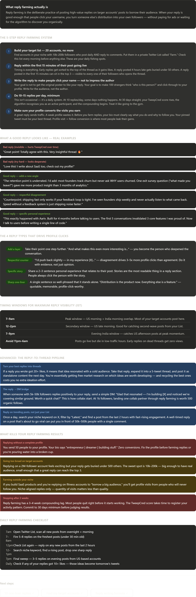

The mental model that makes reply farming click: you're not writing replies to get likes on the reply. You're writing a mini-advertisement for your profile, placed inside someone else's distribution. Every reply is a billboard. The question is never "did the original poster appreciate this?" — it's "did a stranger read this and want to know more about me?"
The third good reply example is your actual edge — the Aariv story about building for 4 months before talking to users. That's real, specific, and instantly relatable to every founder who's done the same thing (which is most of them). When you drop that story as a reply on a post about product validation or talking to users, it will consistently outperform any generic advice reply because it's true and it has stakes. Build a small bank of 5–6 story-based replies from your real experience and rotate them. They'll do more work than 50 generic "great point" replies ever could.

### How do I find the best accounts to reply farm on for a SaaS builder niche on X?

Great question — the accounts you pick matter as much as the replies themselves. Here's a complete system for finding and vetting them:
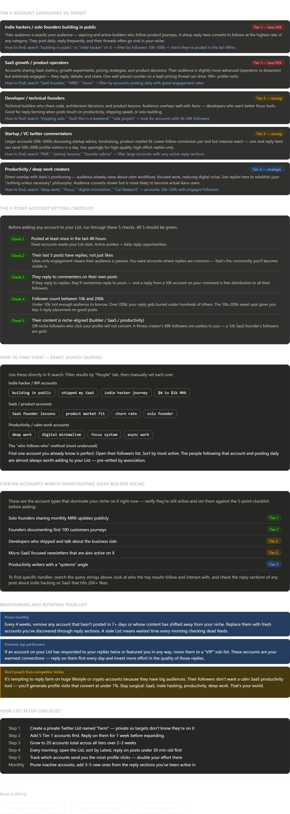

The "who follows who" method in the search section is genuinely the fastest way to build a quality List. Find one account you're certain is perfect — say, a solo founder with 30k followers who posts daily about SaaS metrics — and just work through their followers list looking for other active posters. The overlap is almost always 80%+ relevant because niche communities on X are tightly interconnected. You can build your entire 20-account List in an afternoon this way rather than hunting one by one through searches.
The other thing worth emphasizing: Tier 3 (productivity / deep work accounts) is actually the most strategically important category for Aariv specifically. Those followers aren't just potential followers — they're potential users. Someone who follows a digital minimalism account and sees your reply about building a "nothing unless necessary" productivity tool is far more likely to sign up for Aariv than a generic SaaS founder who just wants growth tactics. So while the follow conversion rate might be slightly lower, the user conversion rate is much higher. Keep a few strong Tier 3 accounts on your List for that reason even as you scale.

### How does engagement velocity affect X algorithm reach?

Here's a deep breakdown of one of the most powerful — and most misunderstood — signals in the X algorithm:

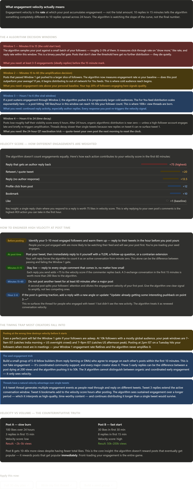

The velocity vs volume comparison at the bottom is the single most important thing to internalize from all of this. Most creators look at their analytics and see a post with 200 likes and think it performed well — but if those 200 likes came in over 24 hours, the algorithm already gave up on it by hour 6. Meanwhile a post with 40 likes that arrived in the first 30 minutes may have hit 80k views before decaying.
This changes how you should think about everything — your posting time, the quality of your hook (because the hook determines your Window 1 click-through rate), your habit of replying to comments immediately, and whether you have even a small group of people who will engage with your post in the first 10 minutes. The algorithm is essentially running a real-time auction for attention, and velocity is your bidding currency. Front-load everything.
For Aariv specifically, one practical move: next time you ship a feature or hit a milestone, don't post it at whatever time you finish working. Save it, schedule it for 7am IST, write the strongest hook you can, and commit to being online for the first 30 minutes to reply to every comment. That one habit change alone will multiply your reach on every post going forward.

### How do I reply to my own tweets to boost algorithm reach?

This is one of the most underused tactics on X — most people post and walk away, leaving massive reach on the table. Here's the complete system:

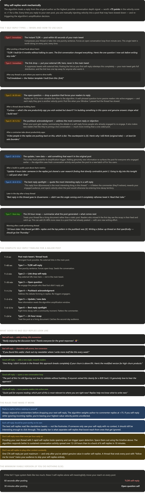

### Why does X algorithm suppress external links?

Great question — the suppression is real, severe, and has a very deliberate business logic behind it:

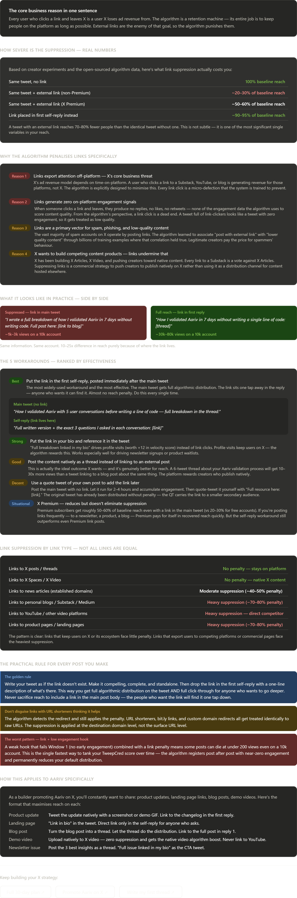

The "link type" section is worth paying close attention to — the penalty isn't a blunt instrument applied equally to all URLs. X is specifically aggressive about platforms it competes with directly: YouTube, Substack, Medium, and commercial landing pages get the heaviest treatment. Links to news articles from established domains get a lighter touch because X wants to be seen as a news platform and needs that content. Understanding this lets you make smarter decisions about where you host things.
The most important practical implication for you as someone building Aariv: never link to a YouTube demo. Upload your demo videos natively to X instead. Native video gets a significant algorithmic boost — it's one of the strongest positive signals in the current system — while a YouTube link gets one of the heaviest penalties. Same video, completely opposite algorithmic treatment. That single decision on every product update you post will make a material difference to how many people see your work.

